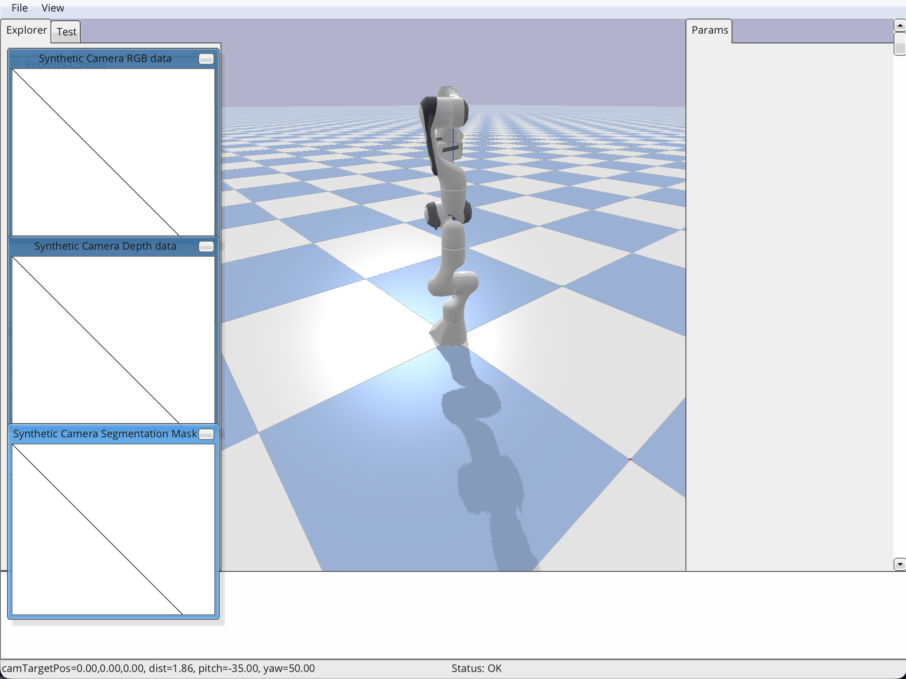

# Introduction

**PyBullet** is the Python interface for the [Bullet Physics SDK](https://pybullet.org/). It is a high-performance physics engine used widely for **Reinforcement Learning (RL)**, **Motion Planning**, and **Sim-to-Real** transfer in robotics.

## Libraries & Docs
- [PyBullet Quickstart Guide](https://docs.google.com/document/d/10sXEhzFRSnvFcl3XxNGhnD4N2SedqwdAvK3dsihxVUA/edit) - The ultimate API reference.
- [pybullet-industrial](https://github.com/p_industrial) - Tools for manufacturing and end-effector simulation.
- [Bullet Docs](https://github.com/bulletphysics/bullet3/tree/master/docs) - GiHub Repo.

---

## Core Architecture
PyBullet operates on a **Client-Server** model. Your Python script is the *Client*, sending instructions to the *Physics Server* which handles the heavy math.

### Connection Modes
* **`p.GUI`**: Opens a 3D visualizer window. Best for debugging and watching your robot move.
* **`p.DIRECT`**: No window (headless). Used for high-speed training on servers or in the cloud.

---

## The URDF
The **Unified Robot Description Format (URDF)** is an XML file that defines the robot's structure using a tree-like hierarchy.

### Links vs. Joints
* **Links (The Bones):** Rigid bodies. Each link contains:
    * `<visual>`: The 3D model (what it looks like).
    * `<collision>`: The simplified "hit-box" (for physics calculations).
    * `<inertial>`: Mass and inertia properties.
* **Joints (The Hinges):** Connects a "Parent Link" to a "Child Link."
    * **Revolute:** Rotational movement with limits (e.g., an elbow).
    * **Continuous:** Rotational movement without limits (e.g., a wheel).
    * **Prismatic:** Linear sliding movement (e.g., a piston).
    * **Fixed:** No movement allowed (e.g., a camera mount).

### Example
2D Pendulum with 1 linear movement and 1 rotational movement.
```xml
<?xml version="1.0"?>
<robot name="pendulum">
    <link name="world">
    </link>

    <joint name="world_to_cart" type="prismatic">
        <parent link="world"/>
        <child link="cart"/>
        <origin xyz="0 0 0"/>
        <axis xyz="1 0 0"/>
        <limit lower="-5" upper="5" effort="1000" velocity="100"/>
    </joint>
    
    <link name="cart">
        <visual>
            <geometry>
                <box size="1 0.5 0.2"/>
            </geometry>
            <material name="kokot">
                <color rgba="0.2 0.2 1 0.9"/>
            </material>
        </visual>
        <collision>
            <geometry>
                <box size="1 0.5 0.2"/>
            </geometry>
        </collision>
        <inertial>
            <mass value="1.0"/>
            <inertia ixx="0.01" ixy="0" ixz="0" iyy="0.01" iyz="0" izz="0.01"/>
        </inertial>
    </link>

    <joint name="cart_to_pole" type="continuous">
        <parent link="cart"/>
        <child link="pole"/>
        <origin xyz="0 0 0"/>
        <axis xyz="0 1 0"/>
    </joint>

    <link name="pole">
        <visual>
            <origin xyz="0 0 0.5"/>
            <geometry>
                <cylinder radius="0.03" length="1.0"/>
            </geometry>
            <material name="curak">
                <color rgba="1 0.2 0.2 1"/>
            </material>
        </visual>
        <collision>
            <origin xyz="0 0 0.5"/>
            <geometry>
                <cylinder radius="0.03" length="1.0"/>
            </geometry>
        </collision>
        <inertial>
            <origin xyz="0 0 0.5"/>
            <mass value="1"/>
            <inertia ixx="0.004" ixy="0" ixz="0" iyy="0.004" iyz="0" izz="0.0001"/>
        </inertial>
    </link>
</robot>
```

---

## Essential Commands

### Simulation Setup
```python
import pybullet as p
import pybullet_data

# Connect and set search path for default models
p.connect(p.GUI)
p.setAdditionalSearchPath(pybullet_data.getDataPath())

# World settings
p.setGravity(0, 0, -9.81)
p.loadURDF("plane.urdf") # Load a floor
```

### Robot Control & State
| Feature | Command |
| :--- | :--- |
| **Load Robot** | `robotId = p.loadURDF("robot.urdf", [x, y, z])` |
| **Step Physics** | `p.stepSimulation()` (Call this in a loop!) |
| **Get State** | `pos, orn = p.getBasePositionAndOrientation(robotId)` |
| **Move Joint** | `p.setJointMotorControl2(robotId, jointIdx, p.POSITION_CONTROL, targetPosition=val)` |
| **Inverse Kinematics** | `jointPoses = p.calculateInverseKinematics(robotId, eeIdx, [x, y, z])` |

---

## Test Script
Copy and paste this into a `.py` file to see a simple robotic arm in action.

```python
import pybullet as p
import pybullet_data
import time

# Initialize
p.connect(p.GUI)
p.setAdditionalSearchPath(pybullet_data.getDataPath())
p.setGravity(0, 0, -9.81)

# Load Plane and Robot
planeId = p.loadURDF("plane.urdf")
robotId = p.loadURDF("franka_panda/panda.urdf", useFixedBase=True)

# Simulation Loop
for i in range(1000):
    # Move joint index 0 to a sine-wave position
    targetPos = 1.0 * (i / 100.0)
    p.setJointMotorControl2(robotId, 0, p.POSITION_CONTROL, targetPosition=targetPos)
    
    p.stepSimulation()
    time.sleep(1./240.) # 240Hz is the default step frequency

p.disconnect()
```



---

## Tips
1.  **Quaternions:** PyBullet uses Quaternions $(x, y, z, w)$ for rotation. Use `p.getQuaternionFromEuler([r, p, y])` if you prefer working with degrees/radians.
2.  **Indexing:** Joint indices start at $0$. Always check `p.getNumJoints(robotId)` and `p.getJointInfo()` to identify which index corresponds to which motor.
3.  **Real-Time:** If you don't want to manually step the simulation, use `p.setRealTimeSimulation(1)`, but note this is less deterministic for AI training.

---

## Useful Tools
### CAD & Modeling
- [Onshape](https://www.onshape.com/) - Cloud CAD with native URDF export.
- [MeshLab](https://www.meshlab.net/) - For simplifying STL meshes for faster simulation.

### VS Code Extensions
- `URDF` & `URDF Previewer` - Live 3D visualization of your robot model.
- `Error Lens` - Inline error reporting for faster debugging.

---

# Installation

To install PyBullet on Windows, follow these steps to ensure the necessary C++ compiler is available:

1.  **Download Visual Studio Build Tools**: 
    Go to the [Visual Studio Build Tools page](https://visualstudio.microsoft.com/visual-cpp-build-tools/) and download the installer.
2.  **Configure Workloads**:
    * Open the **Visual Studio Installer**.
    * Select **Modify** on your Build Tools installation.
    * Under the "Workloads" tab, check **Desktop development with C++**.
    * Click **Modify** or **Install** to apply changes.
3.  **Install via pip**:
    Open your terminal or command prompt and run:
    ```bash
    pip install pybullet
    ```