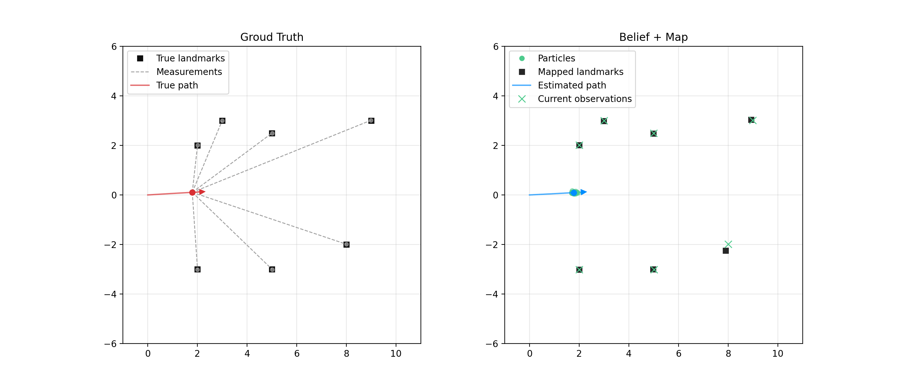

# 0MR (2025/2026)
BUT FEM robotics course in Python.

---

## [01 Introduction](01_python_introduction)
Short presentation in [PDF](01_python_introduction.pdf).
- [ecosystem/](01_python_introduction/01_ecosystem): VENV, PIP, entry point, project structure
- [data structures/](01_python_introduction/02_data_structures): list, tuple, dict, set, np.array
- [classes/](01_python_introduction/03_classes): basics, inheritance, abstract, polymorphism
- [state space search/](01_python_introduction/01_ecosystem/): DFS, BFS

---

## [02 Particle Filter](02_particle_filter)
Examples and explanatory videos on YT: [MATLAB](https://www.youtube.com/watch?v=NrzmH_yerBU) video about SLAM and PF with animations, [Cyrill Stachiniss](https://www.youtube.com/watch?v=eAqAFSrTGGY&t=1307s) explains PF with more mathematical approach.
- [archive/](02_particle_filter/archive_classes/): Python scripts from each class (MON, TUE)

### Scripts:
- [demonstration](02_particle_filter/particle_filter_demo.py) - simple demonstration of mobile robot driving forward and localization using particle filter
- [game](02_particle_filter/particle_filter_game.py) - gamified version of robot in space equipped with lidar using PF for localization

## [03 SLAM](03_slam)
Simultaneous Localization and Mapping with Particle Filter.
- [archive/](03_slam/archive_classes/): Python scripts from each class (MON, TUE)

### Scripts:
- [slam_base](03_slam/slam_base-pf_only.py) - starting point for SLAM implementation using Particle Filter from previous class
- [slam_demo](03_slam/slam_demo.py) - demo script animating SLAM algorithm using Particle Filter

---

## [04 PyBullet](04_pybullet)
Introduction to Python interface for the Bullet Physics SDK.